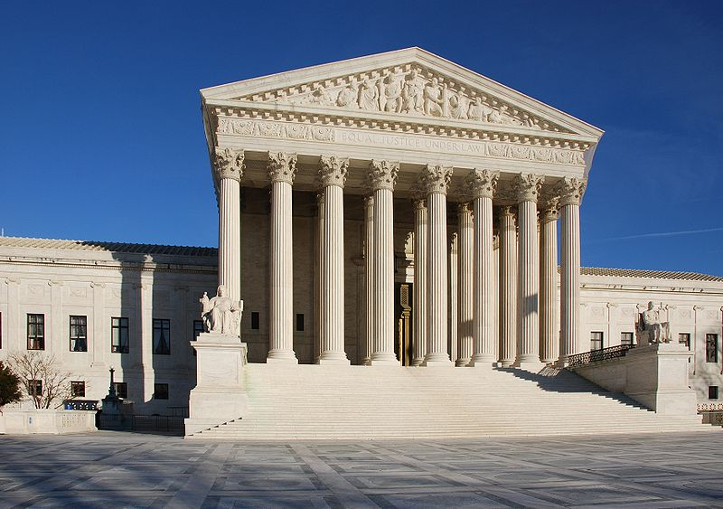

# Court System Overview

<figure><figcaption>
"US Supreme Court" by <a href="https://commons.wikimedia.org/wiki/File:US_Supreme_Court_-_corrected.jpg">Jarek Tuszyński</a> is licensed CC BY-SA 3.0)
</figcaption></figure>

## Outline


[Broken link](broken-reference)



[Broken link](broken-reference)



[Broken link](broken-reference)



[Broken link](broken-reference)


***


**LEARNING OUTCOMES**

* Understand the various functions of the American legal system.
* Describe the foundation and sources that establish American law.


***

Attributions and Licensing

Except where otherwise noted, this page's content is adapted from [1.1 Basic American Legal Principles](https://openstax.org/books/business-law-i-essentials/pages/1-1-basic-american-legal-principles) in [_Business Law Essentials_ ](https://openstax.org/details/books/business-law-i-essentials)by Mirande Valbrune and Renee De Assis, used under [CC BY 4.0](https://creativecommons.org/licenses/by/4.0/). This page is licensed under [CC BY 4.0](http://creativecommons.org/licenses/by/4.0/?ref=chooser-v1).

